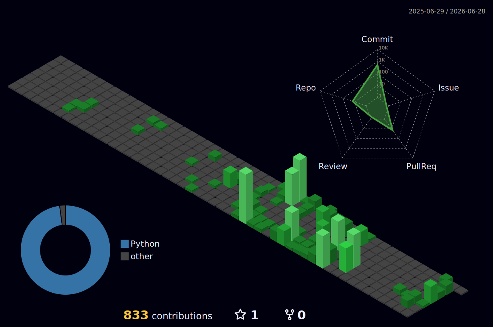

<!-- Animated Header -->

  

  &#8287;
  &#8287;
  &#8287;
  <picture></picture>

 

## About Me

AI Engineer with **5+ years** building enterprise automation platforms, knowledge graph systems, and cloud data pipelines. I architect AI systems where **reliability matters** — combining knowledge graphs, LLM orchestration, and deterministic code generation to deliver measurable business outcomes.

> *Deterministic foundations with AI augmentation — reliability over cleverness.*

  <picture></picture>&#8287;
  <picture></picture>

  <picture></picture>&#8287;
  <picture></picture>&#8287;
  <picture></picture>&#8287;
  <picture></picture>

 

## Tech Stack

  <picture></picture>

  <picture></picture>
  <picture></picture>
  <picture></picture>
  <picture></picture>
  <picture></picture>
  <picture></picture>
  <picture></picture>
  <picture></picture>
  <picture></picture>
  <picture></picture>
  <picture></picture>
  <picture></picture>

 

## Projects

<table>
  <tr>
    <td width="50%" valign="top">
      <h3 align="center">2nd Brain</h3>
      

        <picture></picture>&#8287;
        <picture></picture>
      

      
<strong>AI-powered knowledge management system</strong> that auto-organizes thoughts so your real brain can just think. Drop notes into a frictionless inbox like Slack or Obsidian, and the AI handles all sorting — detecting patterns and pushing daily summaries.

    </td>
    <td width="50%" valign="top">
      <h3 align="center">Whale Market News Agent</h3>
      

        <picture></picture>&#8287;
        <picture></picture>
      

      
<strong>Market intelligence agent</strong> ingesting SEC regulatory filings and news, classifying events across 12+ taxonomy dimensions, and generating structured investment signals for 1000+ equities.

      

        <picture></picture>
        <picture></picture>
        <picture></picture>
        <picture></picture>
        <picture></picture>
      

    </td>
  </tr>
  <tr>
    <td width="50%" valign="top">
      <h3 align="center">LinkedIn Outreach</h3>
      

        <picture></picture>&#8287;
        <picture></picture>
      

      
<strong>AI-powered LinkedIn outreach agent</strong> that generates hyper-personalized connection requests and messages by analyzing prospect profiles, mutual interests, and engagement history to maximize response rates.

      

        <picture></picture>
        <picture></picture>
        <picture></picture>
        <picture></picture>
      

    </td>
    <td width="50%" valign="top">
      <h3 align="center">AI Product Council</h3>
      

        <picture></picture>&#8287;
        <picture></picture>
      

      
<strong>Multi-agent product advisory system</strong> that simulates a panel of specialized AI advisors — strategist, engineer, designer, analyst — to evaluate product ideas, surface blind spots, and generate actionable roadmaps.

      

        <picture></picture>
        <picture></picture>
        <picture></picture>
        <picture></picture>
      

    </td>
  </tr>
  <tr>
    <td width="50%" valign="top">
      <h3 align="center">JobPilot</h3>
      

        
      

      
<strong>Multi-agent AI career platform</strong> with tiered autonomy (L0–L3), two-stage LLM scoring pipeline, preference learning, and Celery-based async task routing.

      

        <picture></picture>
        <picture></picture>
        <picture></picture>
        <picture></picture>
        <picture></picture>
      

    </td>
    <td width="50%" valign="top">
      <h3 align="center">Skillpack</h3>
      

        
      

      
<strong>CLI toolkit with 28+ deterministic engineering skills</strong> spanning data profiling, ETL orchestration, ML baselines, and automated schema validation with full test coverage.

      

        <picture></picture>
        <picture></picture>
        <picture></picture>
        <picture></picture>
      

    </td>
  </tr>
  <tr>
    <td colspan="2" valign="top">
      <h3 align="center">AI Portfolio</h3>
      

        
      

      
<strong>AI-queryable portfolio website</strong> with GPT-4 chat assistant grounded on resume data, streaming responses, rate limiting, honeypot spam detection, and WCAG accessibility compliance.

      

        <picture></picture>
        <picture></picture>
        <picture></picture>
        <picture></picture>
        <picture></picture>
      

    </td>
  </tr>
</table>

### Technical Writing

  

 

## Career Journey

<strong>2025 - Present : AI Engineer @ Infinite Computer Solutions, Irving TX</strong>

 

Architecting enterprise AI platforms combining graph databases, vector search, agentic pipelines, and deterministic code generation for telecom modernization.

<picture></picture> <picture></picture> <picture></picture> <picture></picture> <picture></picture> <picture></picture>

<strong>2024 - 2025 : Data Engineer @ IB Technologies, Franklin TN</strong>

 

Led on-premises SQL Server to Azure Synapse migration. Architected ETL workflows with ADF and Databricks for healthcare data systems.

<picture></picture> <picture></picture> <picture></picture>

<strong>2023 - 2024 : M.S. Computer Information Systems @ Colorado State University</strong>

 

Distributed systems, algorithms, machine learning. Research in AI/ML applications for enterprise systems.

<strong>2020 - 2022 : Data Engineer @ EPAM Systems, Hyderabad</strong>

 

Engineered real-time CDC notification systems, built AWS data lake infrastructure, and deployed containerized data pipelines for healthcare platforms.

<picture></picture> <picture></picture> <picture></picture> <picture></picture>

<strong>2019 : Data Engineer @ CloudTern Solutions, Hyderabad</strong>

 

Built real-time streaming ETL pipelines with Azure Event Hubs and Databricks. Automated database migrations for 300+ tables.

<picture></picture> <picture></picture> <picture></picture>

 

## GitHub Stats

  <picture></picture>

  <picture></picture>
  <picture></picture>

  <picture></picture>

 

  <picture>
    <source media="(prefers-color-scheme: dark)" srcset="./profile-3d-contrib/profile-night-green.svg" />
    <source media="(prefers-color-scheme: light)" srcset="./profile-3d-contrib/profile-green-animate.svg" />
    
  </picture>

 

<picture></picture>

 

<picture>
  <source media="(prefers-color-scheme: dark)" srcset="https://raw.githubusercontent.com/adithya0597/adithya0597/output/github-snake-dark.svg" />
  <source media="(prefers-color-scheme: light)" srcset="https://raw.githubusercontent.com/adithya0597/adithya0597/output/github-snake.svg" />
  
</picture>

 

### Let's Connect

Open to **AI Engineering** and **Data Engineering** roles where I can build production AI systems with real business impact.

&#8287;
&#8287;

